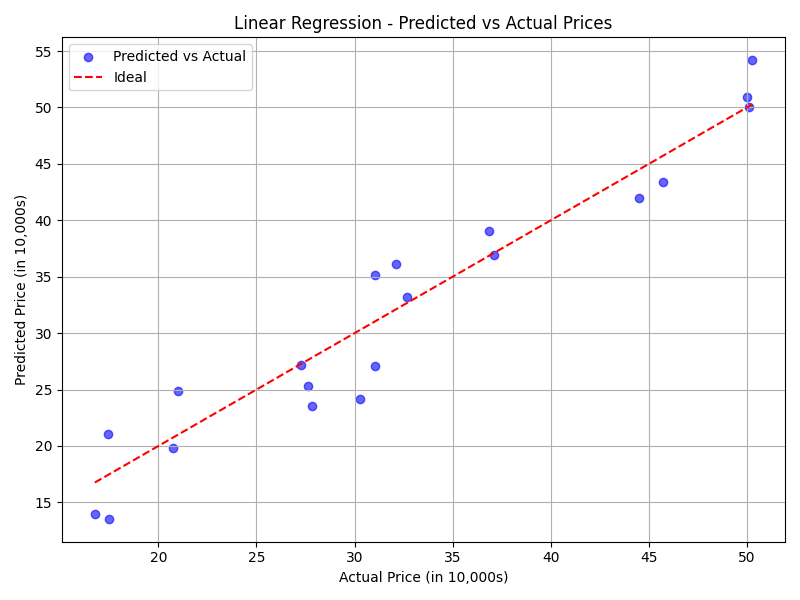
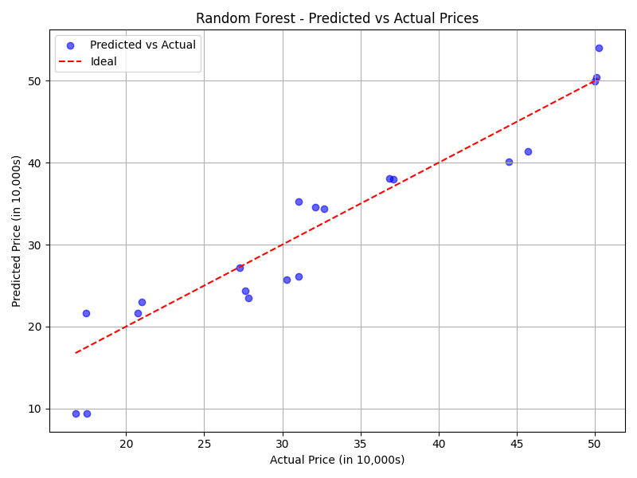
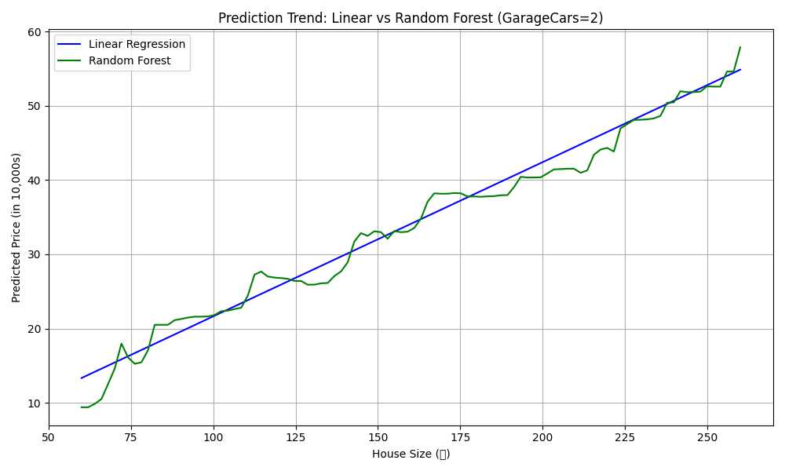

# 🏠 My First Machine Learning Project: House Price Predictor

This is my **first machine learning project**, built as part of my journey to learn and practice real-world ML.  
The goal is to predict house prices based on features like house size and garage capacity using regression models.

---

## 📌 Project Overview

This project trains two models to predict house prices:
- **Linear Regression**
- **Random Forest Regressor**

It uses a synthetic dataset containing:
- `GrLivArea` (Living area in square meters)
- `GarageCars` (Number of garage spots)
- `SalePrice` (Price in 10,000s)

---

## 🚀 Technologies Used

- Python 🐍
- `pandas`, `numpy` for data manipulation
- `scikit-learn` for model building and evaluation
- `matplotlib` (optional) for visualization

---

## 🧪 How to Run

1. Install dependencies:
    ```bash
    pip install -r requirements.txt
    ```

2. Run the script:
    ```bash
    python house-price-predictor.py
    ```

3. You will see:
    - Predicted price for a 150㎡ house with 2-car garage
    - Model evaluation metrics (MAE, RMSE, R², MAPE)

---

## 📊 Sample Output

```
Linear Predicted price: 32.02 (in 10,000s)
📊 Model Evaluation Metrics:
MAE : 2.64
MSE : 9.81
RMSE: 9.81
R²  : 0.9162
MAPE: 9.72%
```

---

### 📊 Linear Regression Results


### 🌲 Random Forest Results


### 📈 Trend Comparison: Linear vs Random Forest
This chart shows how predictions change as house size increases (garage spaces = 2).


---

## 💡 What I Learned

- How to load and prepare structured data
- How to train ML models with `scikit-learn`
- How to evaluate model performance using common regression metrics
- How to improve predictions by adding more data

---

## 📚 Future Improvements

- Wrap the whole process into a `Pipeline`
- Add model saving/loading (`joblib`)
- Add visualizations for predictions
- Try other models like XGBoost or Gradient Boosting

---

## 🙌 About Me

I am Randy J, I'm currently learning machine learning step-by-step.  
This is my first real-world attempt — feel free to give feedback or suggestions!

